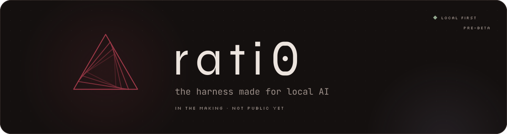
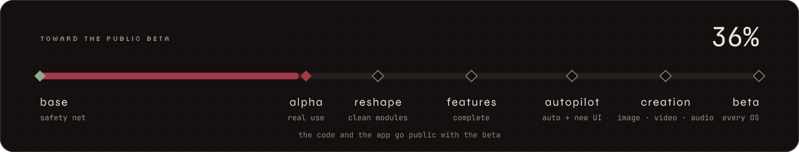
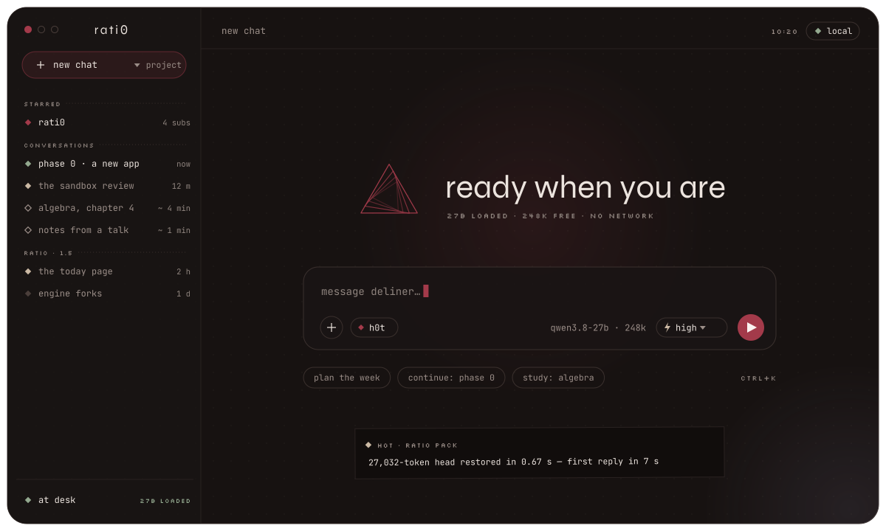
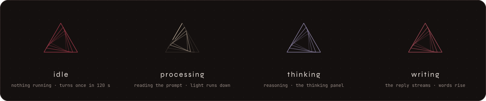
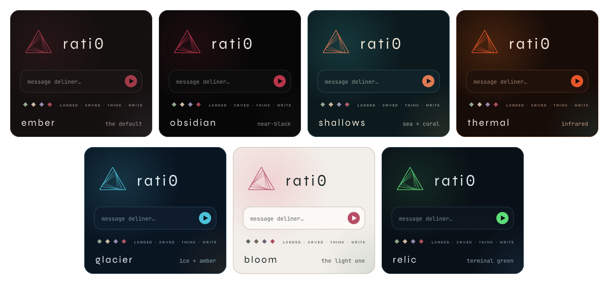

**rati0** is a personal AI workplace in the making. It runs
entirely on one machine: a desktop app wrapped around
[pi](https://www.npmjs.com/package/@earendil-works/pi-coding-agent), a
local model, and an agent called **Deliner** that lives there. This
repository holds only the idea and some pictures. The code and the app
become public with the beta.

The empty chat, drawn from rati0's design language.

## The idea

Most AI apps are a chat box in front of someone else's computer. rati0 is
the opposite: a workplace on your own machine, where the agent has a room
of its own.

- **pi at the centre.** rati0 doesn't write its own agent. Every session is
  a pi process, and everything that decides (permissions, tools, model
  moves) is a pi extension. The app is the window, the memory and the
  furniture.
- **Projects first, chat second.** A project is a folder with a board. It
  starts with a *phase 0* where Deliner learns what the project is and
  writes the plan. Every session after that builds on the plan.
- **Local by default.** The model runs on the same laptop. Nothing leaves
  the machine unless you let it.
- **Measured, not assumed.** Every rule in the code was measured on real
  hardware, and a context that's already been read is never paid for twice.

## Things it does

- **Contexts that survive.** Switching away saves a conversation's model
  state to disk, and coming back restores it in seconds instead of
  re-reading it for half an hour. The sidebar shows which chats are live,
  saved or cold.
- **Hot starts.** A new chat begins from a pre-baked head (tools, prompt,
  memory, the project's documents), so the first reply comes in seconds.
- **Boards as plans.** Every project folder has a plan drawn as a board,
  with owners, progress marks and the sessions that worked on each card.
- **A safety net.** The agent's shell runs in a sandbox with no network by
  default. Every turn is checkpointed and can be rewound. What a session
  may do lives in one small policy file.
- **A screen of its own.** The agent gets its own desktop session and
  browser to work in, and asks before anything could send data out.
- **Senses.** Vision on every model, and listening through a small speech
  model.
- **Presence.** The app knows whether you're at the desk, studying or away,
  and behaves accordingly. There's a study tree that grows with the hours.

## The look

rati0 has its own design language: a warm near-black ground, one red, soft
shapes for what you touch, square slightly tilted blocks for what the
machine emits, and a spiral of triangles as its mark.

It comes in seven colorways:

## Where it's going

- **1.0, the alpha:** the core above, tested on a real second project.
- **lessons:** the codebase gets reshaped into clean modules.
- **1.5:** the current feature list, finished.
- **2.0:** an auto mode where the agent works through its board with a
  supervisor watching, web search behind a strict gate, new models, and a
  new UI.
- **2.5:** image, video and audio generation.
- **3.0, the beta:** Windows, macOS and Linux. **The code and the app go
  public here.**

The percentage above is an estimate of the way to the beta. It gets
updated as the work lands.

---

rati0 is a personal project by <a href="https://github.com/facthhor">@facthhor</a>. Nothing to install yet.
